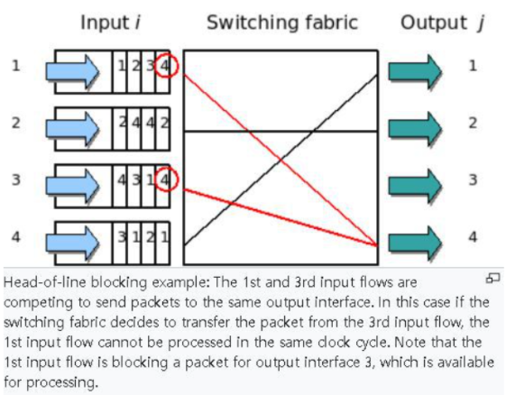
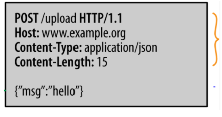

# [CS] HTTP1.1 vs HTTP2.0

## 0. 개요
이 글은 HTTP의 세부적인 내용에 대해서는 다루지 않고, 기존 HTTP 1.1의 문제점을

HTTP 2.0에서 어떻게 극복하였는가를 중점으로 다룹니다. HTTP에 대한 포괄적인 정리가
필요하신분은 아래 강의를 수강하시면 도움이 됩니다.

[인프런 http-웹-네트워크](https://www.inflearn.com/course/http-%EC%9B%B9-%EB%84%A4%ED%8A%B8%EC%9B%8C%ED%81%AC)

[KOCW 강의](http://www.kocw.net/home/search/kemView.do?kemId=1046412)

자세한 설명은 [https://developers.google.com/web/fundamentals/performance/http2/](https://developers.google.com/web/fundamentals/performance/http2/) 이 글을 참고하시길 바랍니다.

## 1. HTTP?

 **HyperText Transfer Protoco**l 또는 **HyperTexT Protoco**l의 약자이다

 최초 개발시 HTTP의 의미는 하이퍼텍스트를 빠르게 교환하기 위한 프로토콜의 일종으로 즉, **HTTP**는 서버와 클라이언트의 사이에서 어떻게 메시지를 교환할지를 정해놓은 규칙을 지칭한다.

## 2. HTTP 1.1의 결점과 HTTP 2.0의 해결책

### 2-1. HTTP 1.1의 결점(Why HTTP 1.1 Is Slow?)

1. **One Connection - One Response**

HTTP1.1은 한번에 한응답만 처리하도록 구성되어있다 이로 인해 성능상의 저하가 존재한다.

- **HOL(Head Of Line) Blocking - 특정 응답의 지연**

: HOL Blocking이란, 네트워크에서 같은 큐에 있는 패킷이 첫번째 패킷으로 인해 지연되는 경우 발생하는 성능 저하 현상을 의미한다. 직관적인 예시로, 일차선 도로에서 앞차가 좌회전 신호를 기다리는 동안에, 내가 직진을 하고 싶어도 할 수 없듯이, 패킷이 다른 

- **RTT(Round Trip Time) 증가**

: HTTP는 기본적으로 Connection당 하나의 요청을 처리하도록 설계되있다(3-way handshaking)

동시전송이 불가능하고 요청과 응답이 순차적으로 이루어지는 구조여서 리소스 개수에 비례하 여 , 대기시간이 길어진다. 구체적인 예로 하나의 큰이미지를 전송하는 것보다 그것을 잘게 쪼갠 100 개의 이미지를 전송하는데 더 오랜 시간이 소모 된다.

참고사이트 : https://http2.golang.org/gophertiles

2. **무거운 Header 구조**

: Http/1.1의 헤더에는 많은 메타정보들과 실제로 전송할 정보 등 많은 정보들이 저장되어 있다. 이 무거운 헤더를 매 요청시마다 전송하게되며(순수 HTTP1.1 가정), domain에 설정된 cookie정보도 헤더에 포함되어 전송된다. 극단적으로 위의 예에서 처럼 전송하라는 정보는 "hello" 한 단어인데, 헤더가 더 큰 경우가 자주 발생한다.

### 2-2. HTTP 2.0의 해결.

: SPDY(스피디) 기반의 HTTP 2.0의 등장. **Better Performance**

1. **Mutiplexed Streams**

    : 한 커넥션으로 **동시에 여러개의** 메시지를 주고 받을 수 있으며, 응답또한 순서에 상관없이 스트림으로 주고 받는다. 스트림에 우선순위를 설정하는 것을 통해서 응답이 어느 순서로 오건 상관없이 처리가 가능해졌다.

 2. **Header Compression**

  : Header 정보 압축을 위해 Header Table(헤더에 대한 정보를 각각 에서 보유)와 Huffman Encoding 기법을 사용하여 처리하며 이는 HPACK이라고 불린다. 구체적으로 중복된 Header에 대한 정보는 index 값만 전송하고, 중복되지 않은 Header 정보의 값은 인코딩하여 전송한다. 

---

**기존 결점의 해결에서 나아간 HTTP 2.0의 기능/변화.**

3. **Server Push**

서버가 클라이언트 요청에 대해 여러 응답을 한번에 보낼 수 있다. 즉, 서버는 요청에 응답할 뿐만 아니라 클라이언트가 명시적으로 요청하지 않아도 추가적인 리소스를 클라이언트에 푸시할 수 있다. 엄격한 Ack - Repsonse 체계에서 벗어나, 서버가 미리 클라이언트가 필요한 정보를 인지하고 푸쉬함으로써, 좀 더 빠른 응답을 받을 수 있도록 한다.

4. **바이너리 프레이밍 계층**

 줄바꿈으로 구분되는 일반 텍스트 HTTP/1.x 프로토콜과 달리, 모든 HTTP/2 통신은 더 작은 메시지와 프레임으로 분할되며, 각각은 바이너리 형식으로 인코딩되어 있다. 더 작은 메시지와 프레임으로 분할함으로써, 더 많은 종류의 정보를 전달할 수 있게되었다(스트림의 구현 등)

**세줄요약** 

- HOL 블로킹과 RTT 지연을 일으키는 하나의 요청만을 한번에 처리할 수 있는 HTTP1.1의 문제를, HTTP 2.0에서는 멀티플렉싱을 지원함으로써 개선하였다.
- 무거운 헤더로 인한 중복 정보 전달로 인한 성능저하를 HTTP2.0에서는 HPACK(Header Table, 허프만 인코딩)을 이용해 헤더를 압축시킴으로써 향상 시켰다.
- 이외의 HTTP 2.0의 핵심적인 변화는 Server Push와 바이너리 프레이밍 계층이며, 이들 또한 성능향상에 도움을 주었다.

## 3. 면접예상질문

1. HTTP 1.x와 HTTP 2의 가장 큰 차이점은 무엇인가?
2. HTTP 1.x와 HTTP 2의 차이는 무엇에서 비롯되는가
3. HTTP 1.x가 가지고 있는 문제는 어떤 것이였으며, 이를 어떻게 보완했는지? 

## 4. 참고자료

A. **블로그**

[https://seokbeomkim.github.io/posts/http1-http2/#%EB%8B%A8%EC%A0%90-2-rttround-trip-time-%EC%A6%9D%EA%B0%80](https://seokbeomkim.github.io/posts/http1-http2/#%EB%8B%A8%EC%A0%90-2-rttround-trip-time-%EC%A6%9D%EA%B0%80)

https://www.digitalocean.com/community/tutorials/http-1-1-vs-http-2-what-s-the-difference

B. **공식 자료**

- http 2.0 공식 설명자료

[https://github.com/bagder/http2-explained](https://github.com/bagder/http2-explained)

[https://http2-explained.haxx.se/ko/part1](https://http2-explained.haxx.se/ko/part1)

- http 3.0 공식 설명자료

[https://github.com/bagder/http3-explained](https://github.com/bagder/http3-explained)

https://http3-explained.haxx.se/ko/

- 공식문서 Specification

http1(rfc 1945) https://tools.ietf.org/html/rfc1945

http2(rfc 7540) https://tools.ietf.org/html/rfc7540

C. **이해하기 좋은 유튜브 영상**

- 우아한 tech talk http1.0 vs http2.0

[https://www.youtube.com/watch?v=xcrjamphIp4](https://www.youtube.com/watch?v=xcrjamphIp4)

- chrome summit 2015 http2.0

https://www.youtube.com/watch?v=r5oT_2ndjms