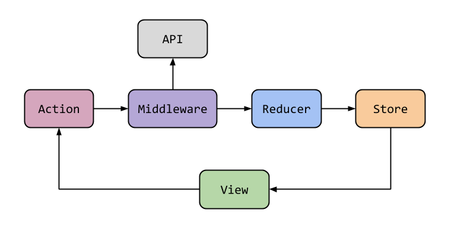
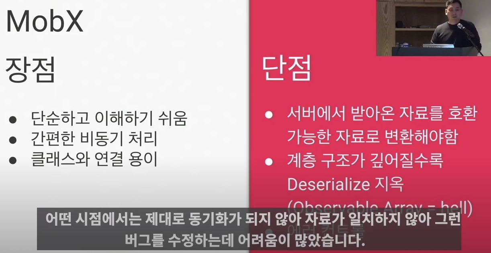
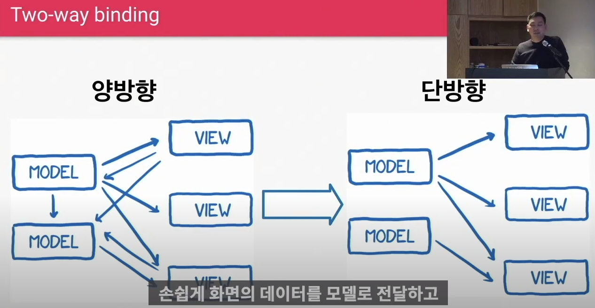
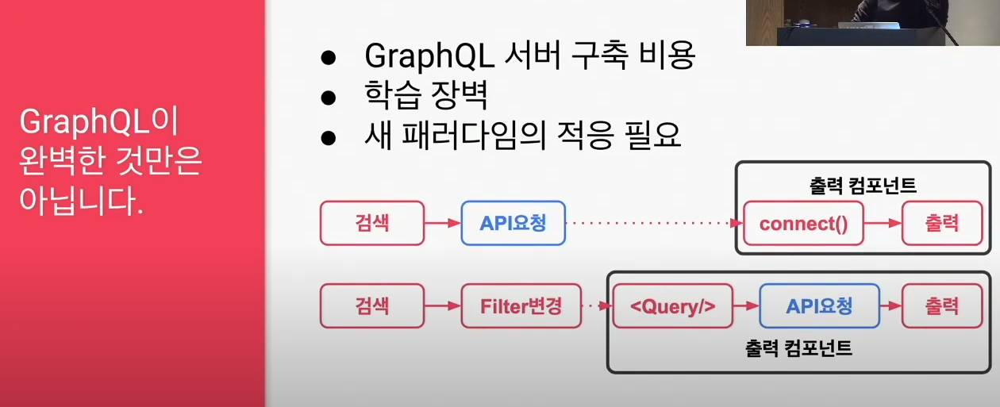
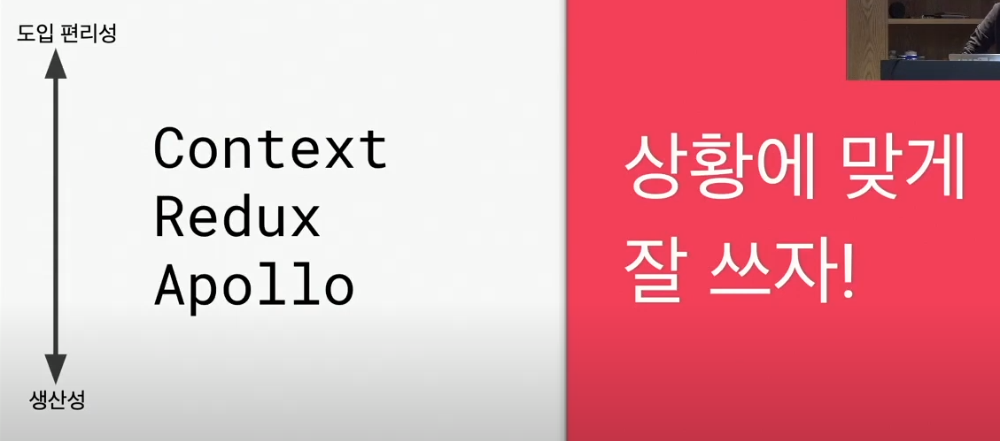

# Redux

## Redux란?

리덕스는 (전역)상태 관리 라이브러리

썻을 때 장점으론, 컴포넌트로 부터 상태관리 코드를 분리할 수 있습니다.

(MobX와 비교시) 단방향 데이터 흐름을 강조하기 때문에, 상태 변경에 대한 구조를 파악하기 쉬워 개발 생산성이 뛰어납니다.

### 이해를 돕기 위한 이미지

## 리덕스 자체 개념 정리

- 액션

  type속성 값을 가진 객체로, `어떤` 리듀서를 호출할 것인지만 적습니다.

- 미들웨어(redux에서의)

  리듀서를 감싸고 있는 함수로써, 리듀서가 실행되기 전, 후의 처리를 할 수 있습니다.
  예시로는

  1. store의 상태 변경 이전과 이후 파악
  2. 에러 처리
  3. delay나 debounce
  4. localStorage 값 이용

- 리듀서

  액션이 발생했을 때, 새로운 상태값을 만드는 함수, `어떻게` 스토어를 변경할 것인지 적습니다.

  다른 어떤 방법으로도 store를 변경하면 안되고 오직 reducer로만 변경할 수 있도록 합니다.

  따라서 store가 어떻게 변경될 것인지 잘 알 수 있습니다.

  추가.
  순수함수로 작성해야 합니다.(입력이 같으면 출력도 같다, 부수효과는 없다.)
  상태값은 불변 객체로 관리해야 합니다.(immer.js 사용 추천)

- 스토어

  상태값을 저장하는 역할과,
  액션 처리가 끝낫다는 것을 외부에 알려주는 역할을 수행합니다.

## 리덕스 관련 라이브러리 개념 정리

- react-redux

  리액트에서 리덕스를 사용할 시(리덕스는 Vue나 Angular에서도 사용) 자주 사용된다.
  해당 라이브러리를 쓰면
  (Provider, useSelector)특정 상태 값에 변경에만 해당되는 컴포넌트를 변경할 수 있다.
  (reselect.js)여러개의 상태값을 가져와야 할 때, 사용 추후 정리

- redux-toolkit

  리덕스에서 보일러 플레이트한 코드(그냥 비슷한 코드의 묶음)를 많이 작성해야 하는데
  이를 효과적으로 줄일 수 있다.
  redux에서 공식적으로 만든 라이브러리

- redux-thunk

  비동기 통신을 위한 미들웨어 라이브러리
  가장 간단하게 구현할 수 있지만, 복잡하거나 많은 비동기 통신을 처리해야 할 때 훨씬 까다로워진다.

- redux-observable

  비동기 통신을 위한 미들웨어 라이브러리
  복잡하거나 많은 비동기 통신을 처리할 수 있다.
  RxJS 패키지 기반으로 작동
  이는 리액티브 프로그래밍 문법으로 작성하길 강제하기 때문에 입문도가 가장 난이도가 높음

- redux-saga

  비동기 통신을 위한 미들웨어 라이브러리
  복잡하거나 많은 비동기 통신을 처리할 수 있다.
  제너레이터 문법을 사용(JS자체 문법)
  때문에 redux-observable보다 배우기 쉽다.

## 리덕스를 대체할 수 있는 라이브러리 개념 정리

- Context API, constate

  단순히 prop drilling 문제때문이라면 사용할 수 있는 수단들
  Context API는 react에서 자체 내장된 함수로, 원하는 자식에게 다이렉트로 값을 전달할 수 있다.
  사용하는 문법은 가장 쉬움
  대신 코드가 상태가 조금만 복잡해져도 사용하기 까다롭다.

  constate는 다뤄야하는 상태가 많아진 상황에서 성능도 챙겨가면서 개발도 편하게 하고 싶다면 사용

- recoil, Jotai, Zustand

  세 라이브러리 모두 전역 상태 관리를 더 원할하게 할 수 있다.

  recoil은 리액트가, Jotai와 Zustand는 뭐 이전에 만들어 져있다.

- react-query, SWR

  API통신을 하고싶다면 여기서 처리할 수 있다.

  브라우저 캐시까지 지원한다.

- MobX, GraphQL & Apollo

  

  

  

  

## 리덕스 그래서 왜 써야해?

전역상태 관리를 원한다면 간단하게는 Context API, constate를 쓸 수 있고,
복잡하게도 recoil, Jotai, Zustand를 사용할 수 있다
더 적은 코드로

API통신을 위한 거라면 react-query, SWR을 통해 대체할 수 있다
더 적은 코드로

실제로 많은 회사들이 위의 라이브러리를 채택해 나가고 있었다.

그럼에도 불구하고 하직 redux를 사용하는 이유가 몇가지 잇는데,

1. 빠른 시간에 비슷한 비동기 처리가 들어왔을 때,

이는 현재 redux-saga, redux-observable 또는 MobX, apollo만 해결할 수 있는 것으로 알고 있다.
앞에 두개를 사용하려면, redux를 사용해야하고,

MobX같은 경우 양방향 데이터 흐름이기 때문에 프로젝트가 커질 수록 관리하기 어렵다는 단점이 있고
apollo는 GrapQL서버를 새로 만들어야 하는 비용적 문제와, 새로운 프로그래밍 패러다임에 익숙해져가야 하는 높은 러닝커브를 가지고 있다.

2. 테스트 코드를 작성하기 편하다.
   이거는 말만 많이 들어서 아직 체감하지 못했습니다.

3. 아직까진 가장 많이 사용되는 상태관리 라이브러리!!
   참조할 문서도 많고, 따라서 기능 개발이나 디버깅이 유리하다.

## 참고

[실전 리액트 프로그래밍 - 인프런 | 강의](https://www.inflearn.com/course/%EC%8B%A4%EC%A0%84-%EB%A6%AC%EC%95%A1%ED%8A%B8-%ED%94%84%EB%A1%9C%EA%B7%B8%EB%9E%98%EB%B0%8D/dashboard)

[리덕스 잘 쓰고 계시나요? - 리디주식회사 RIDI Corporation](https://ridicorp.com/story/how-to-use-redux-in-ridi/)

[리덕스를 도입하는데 주저하게 만드는 장벽들 - 1. redux-saga 쓰지 말아야 할 이유](https://www.youtube.com/watch?v=xsOhUX7DDl0)

[프론트엔드 이직 기록](https://velog.io/@lingodingo/%ED%94%84%EB%A1%A0%ED%8A%B8%EC%97%94%EB%93%9C-%EC%9D%B4%EC%A7%81-%EA%B8%B0%EB%A1%9D)

[React Redux vs Context API](https://velog.io/@cada/React-Redux-vs-Context-API)

[[A2] Redux-Saga - 제너레이터, 사이드이펙트, 채널 - 이민규](https://www.youtube.com/watch?v=UxpREAHZ7Ck)
