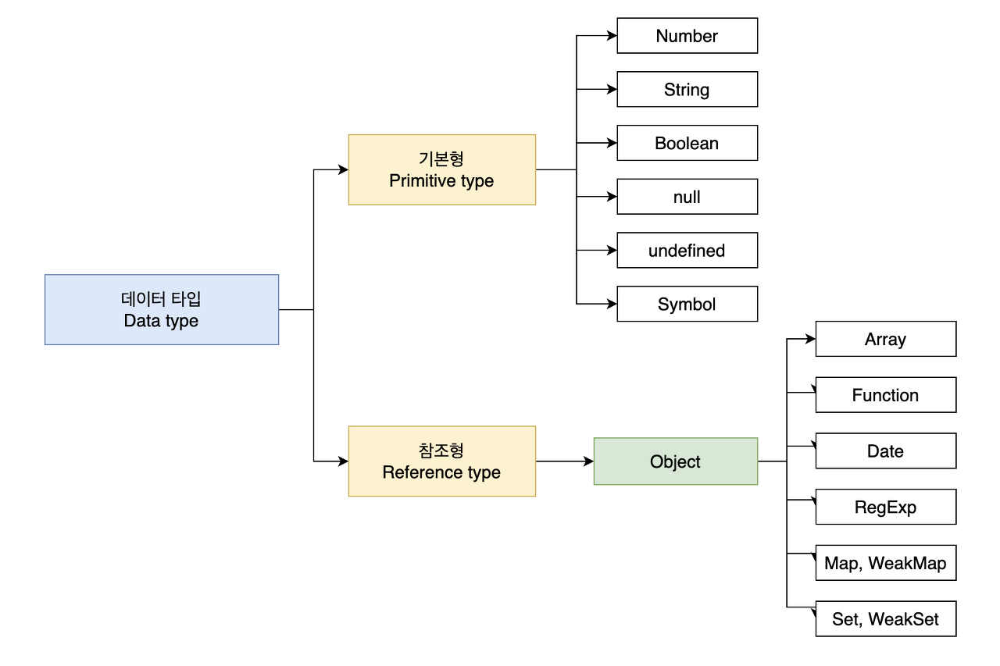
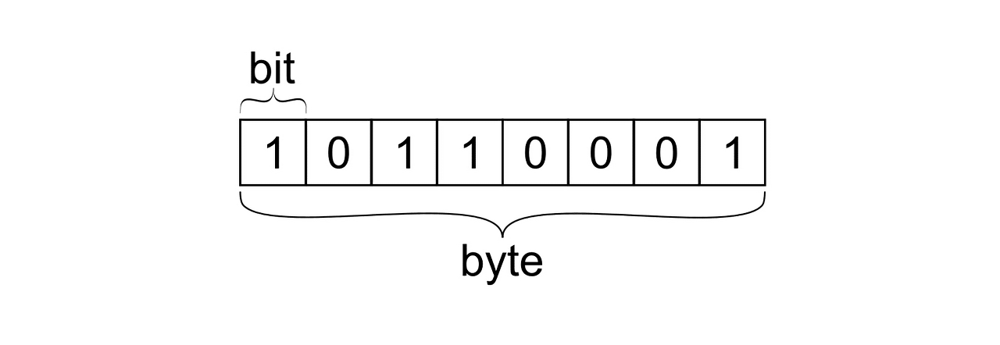

# Javascript 01 | 데이터 타입 (종류 / 배경지식)

이번 게시글은 자바스크립트의 기본기를 다지기 위하여, '데이터 타입'에 대해 알아보도록 할 것입니다.

## 목표
목표는, 자바스크립트가 데이터를 처리하는 과정을 살펴봄으로써, 기본형과 참조형 타입이 서로 다르게 동작하는 이유를 이해하고 활용 가능하도록 하며, 데이터 타입 관련 중요 개념을 확인할 것입니다.

### 1. 데이터 타입의 종류 & 구분 기준
#### 데이터 타입의 종류

데이터 타입의 종류는 위 그림과 같이 크게 기본형, 참조형으로 나뉩니다.  
기본형은 숫자, 문자열, 불린, null, undefined, Symbol (ES6에서 추가)등이 있고, 참조형은 객체가 있고 그 하위분류로 배열, 함수, 날짜, 정규 표현식 등과 ES6에서 추가된 Map, WeakMap, Set, WeakSet 등이 속합니다.  

#### 구분 기준
이들을 구분하는 기준은 무엇일까요?  
일반적으로 기본형은 할당 또는 연산 시에 복제가 되고 참조형은 참조가 된다고 알려져 있지만, 엄밀히 말하면 둘 모두 복제를 합니다.  
다만 차이점은 기본형은 값이 담긴 주솟값을 바로 복제하지만 참조형은 값이 담긴 주솟값들로 이루어진 묶음을 가리키는 주솟값을 복제합니다.  
또한, 기본형은 불변성(immutability)을 띕니다.  
하지만, 불변성을 띈다는 것이 혼란스러울 수 있습니다. 변수에 기본형 타입을 담더라도 다른 것으로 다시 담는 것이 가능하기 때문입니다.  
그래서 불변성을 잘 이해하기 위해, 개략적으로나마 배경 지식(메모리와 데이터, '식별자'와 '변수'의 개념에 대해 구분 가능한 정도의)에 대해 알아보도록 하겠습니다.  

## 2. 데이터 타입에 관한 배경 지식
### 2-1. 메모리 & 데이터
컴퓨터는 모든 데이터를 0 또는 1로 바꿔서 기억합니다.  

#### 비트 (bit)
0 또는 1로만 표현할 수 있는 하나의 메모리 조각을 비트라고 합니다. 메모리는 매우 많은 비트들로 구성이 되어 있는데, 각 비트는 고유한 식별자(unique identifier)를 통해 위치 확인이 가능합니다.  

#### 바이트 (byte)

* 구성
    1 byte ( = 8 bit )
    1 bit ( = 0 or 1 )

바이트는 (위 사진과 같이) 8개의 비트로 구성되어 있습니다. 또 비트는 2가지 값 (0 또는 1)만 표현할 수 있지요. 그래서 1 byte는 256 (2⁸) 개의 값을 표현할 수 있습니다.  
또한, 시작하는 비트의 식별자로 위치 파악이 가능합니다. 이로 인해, 모든 데이터는 메모리 주솟값(바이트 단위의 식별자)을 통해 서로 구분 및 연결이 가능하게 됩니다.  

* 참고
    과거 메모리 용량이 매우 부족했던 시절과는 다르게, 월등히 커진 상황에 자바스크립트가 등장했습니다.  
    그래서 숫자의 메모리 공간 같은 경우, 64 bit (=8 byte)를 확보합니다. (과거에는 2 또는 4바이트 등으로 나누어 정해서 사용자가 필요시에 형 변환해야 하는 상황들이 있었다고 합니다.)

### 2-2. 식별자 & 변수
#### 변수 & 식별자, 혼용하는 경우가 많다
가능한 이유는 (대부분의 경우, 문맥에 따라) 무엇을 말하고자 하는지 유추 가능하기 때문입니다. 하지만 둘의 차이를 모른다면 혼란스러울 것입니다.  

#### 변수 (variable)
컴퓨터 용어에 맞게 확장시킨 variable의 의미는 **'변할 수 있는 무언가'**입니다.  
여기서 '무언가'란, 데이터를 지칭하는 것으로 숫자, 문자열, 객체, 배열 모두 해당됩니다.  

#### 식별자(identifier)
**변수명** (어떤 데이터를 식별하는 데 사용하는 이름)입니다.  

> '데이터 타입'에 대해서 다음 게시물에 이어서 알아보도록 하겠습니다. 긴 글 읽어주셔서 감사합니다.  

* 참고 : 책 '코어 자바스크립트'_정재남