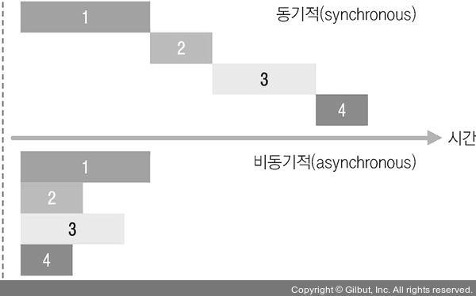

프로그래밍에서 비동기는 기초적이며 중요한 작업입니다.

그래서 이번에는 비동기 작업에 관한 글을 작성해보았습니다. 동기와 비동기에 대해 알아보고 비동기 작업에 해당되는 콜백 함수, Promise, async/await에 대해 알아볼 것입니다.

## 1. 동기 & 비동기

### 1-1. 동기 (synchronous)

동기(synchronous)의 사전적 의미는 '동시에 일어난다'는 뜻입니다. 요청과 그 결과가 동시에 일어난다는 약속이며, 바로 요청하면 시간이 얼마 걸리던지 요청한 자리에서 결과가 주어져야 합니다.

- 요청과 결과가 한 자리에서 동시에 일어납니다.

### 1-2. 비동기(Asynchronous)

비동기(Asynchronous)는 반대로, '동시에 일어나지 않는다'라는 뜻입니다. 요청과 결과가 동시에 일어나지 않을 것이라는 약속입니다.

- 요청한 그 자리에서 결과가 주어지지 않습니다.

### 1-3. 장단점

- 동기 방식

  - 장점

    설계가 매우 간단하고 직관적이다.

  - 단점
    결과가 주어질 때까지 어무것도 못하고 대기해야 한다.

- 비동기 방식

  - 장점

    (결과가 주어지는데 시간이 걸리더라도) 그 시간 동안 다른 작업이 가능해서 자원의 효율적인 사용이 가능하다.

  - 단점
    동기보다 복잡하다.

### 1-4. 서버 API 사용 시, 처리


서버 API 사용 시, 처리할 때 둘은 어떤 차이가 있을까요?

- 동기적으로 한다면,

  요청이 끝날 때까지 기다리는 동안 중지 상태가 되며 다른 작업을 할 수 없게 됩니다. 즉, 끝나야 다른 작업이 가능하게 됩니다.

- 비동기적으로 한다면,
  웹 애플리케이션이 멈추지 않습니다. 동시에 여러 요청 처리가 가능하며, 기다리는 과정에서 다른 함수를 호출할 수 있습니다.

이렇게 서버 API를 호출할 때 외에도 작업을 비동기적으로 처리할 때가 있습니다. 바로 setTimeout함수를 사용하여 특정 작업을 예약할 때입니다.

### 1-5. setTimeout(비동기적 처리)

> 특정 작업 예약

예시 코드를 살펴보겠습니다.

아래 코드는 3초 후에 printMe 함수를 호출합니다.

- 실행 코드

```jsx
function printMe() {
  console.log("Hello World");
}

setTimeout(printMe, 3000);
console.log("대기중...");
```

- 결과

```jsx
"대기중...";
"Hello World";

```

예시 코드는 setTimeout 이 사용되는 시점에서 코드가 3초간 멈추는 게 아닌, 일단 코드가 위~아래까지 다 호출되고 3초 뒤에 지정해준 printMe가 호출되고 있는 것입니다.

이처럼 자바스크립트에서 비동기 작업을 할 때 가장 흔히 사용하는 방법이 콜백 함수를 사용하는 것입니다. 여기서 콜백 함수는 setTimeout함수의 인자로 전달된 'printMe'함수입니다.

그럼 콜백 함수가 정확히 무엇인지 알아보도록 하겠습니다.

## 2. 콜백 함수

> 다른 함수에 매개변수로 넘겨준 함수

### 2-1. 개념

콜백 함수는 위에 적어둔 것처럼, 다른 함수에 매개 변수로 넘겨준 함수입니다.

매개변수로 넘겨받은 함수는 일단 넘겨 받고 때가 되면 나중에 호출(called back)한다는 것이 개념입니다.

### 2-2. 콜백 지옥

- 개념

  코드 형태가 콜백 안에 콜백을 넣어 구현되어 있습니다.

  이것이 많아질 경우, 여러 번 중첩이 되고 그럼 코드 가독성이 나빠지게 됩니다.

- 예시
  파라미터 값이 주어지면 1초 뒤, 10 더해서 반환하는 함수를 만들었습니다. 이 함수를 처리한 후에 어떤 작업을 더 하고 싶다면, 콜백 함수를 활용합니다.

```jsx
function increase(number, callback) {
  setTimeout(() => {
    const result = number + 10;
    if (callback) {
      callback(result);
    }
  }, 1000);
}

increase(0, (result) => {
  console.log(result);
});

// 결과
// 10
```

그런데 이를 여러 번 순차적으로 처리하고 싶다면, 콜백 함수가 중첩되어 다음과 같은 코드가 나오게 됩니다.

```jsx
function increase(number, callback) {
  setTimeout(() => {
    const result = number + 10;
    if (callback) {
      callback(result);
    }
  }, 1000);
}

console.log("작업 시작");
increase(0, (result) => {
  console.log(result);
  increase(result, (result) => {
    console.log(result);
    increase(result, (result) => {
      console.log(result);
      increase(result, (result) => {
        console.log(result);
        console.log("작업 완료");
      });
    });
  });
});

// 실행 결과
/*
    '작업 시작'
    
    10
    
    20
    
    30
    
    40
    '작업 완료'
    */
```

왜 콜백 지옥이라고 부르게 되었는지 이해가 되시나요?

이런 코드를 형성하지 않게 하는 방안이 있습니다. 바로 Promise입니다.

## 3. Promise

여러 작업을 연달아 처리할 때, 함수를 여러 번 감싸지 않고 `.then` 을 사용하여 다음 작업을 설정하게 됩니다. (그럼 콜백 지옥이 형성되지 않게 됩니다.)

### 3-1. 예시 코드

- 실행 코드

```jsx
function increase(number) {
  const promise = new Promise((resolve, reject) => {
    setTimeout(() => {
      const result = number + 10;
      if (result > 50) {
        const e = new Error("numberTooBig");
        return reject(e);
      }
      resolve(result);
    }, 1000);
  });
  return promise;
}

async function runTasks() {
  try {
    let result = await increase(0);
    console.log(result);
    result = await increase(result);
    console.log(result);
    result = await increase(result);
    console.log(result);
    result = await increase(result);
    console.log(result);
    result = await increase(result);
    console.log(result);
    result = await increase(result);
    console.log(result);
  } catch (e) {
    console.log(e);
  }
}
```

- 결과

```jsx
    Promise { <pending> }
    10
    20
    30
    40
    50
    Error: 'numberTooBig'
```

가독성이 훨씬 좋아진 것 같습니다.

하지만, Promise를 더 쉽게 사용할 수 있도록 해주는 문법이 있습니다. 바로 async/await 입니다.

## 4. async/await

> Promise를 더 쉽게 사용할 수 있도록 해주는 ES2017(ES8) 문법

### 4-1. 사용법

함수 앞 부분에 `async` 추가하고 함수 내부의 Promise 앞 부분에 `await` 사용을 사용합니다.

### 4-2. 동작 원리

Promise 끝날 때까지 기다리고 결과 값을 특정 변수에 담을 수 있습니다.

### 4-3. 예시 코드

- 실행 코드

```jsx
function increase(number) {
  const promise = new Promise((resolve, reject) => {
    setTimeout(() => {
      const result = number + 10;
      if (result > 50) {
        const e = new Error("numberTooBig");
        return reject(e);
      }
      resolve(result);
    }, 1000);
  });
  return promise;
}

async function runTasks() {
  try {
    let result = await increase(0);
    console.log(result);
    result = await increase(result);
    console.log(result);
    result = await increase(result);
    console.log(result);
    result = await increase(result);
    console.log(result);
    result = await increase(result);
    console.log(result);
    result = await increase(result);
    console.log(result);
  } catch (e) {
    console.log(e);
  }
}
```

- 결과

```jsx
10;

20;

30;

40;

50;

Error: "numberTooBig";
```

코드가 더 간결해졌습니다.

---

참고

- 책 '리액트를 다루는 기술'\_김민준 저
- [동기와 비동기의 개념과 차이 - 공부해서 남 주자](https://private.tistory.com/24)
